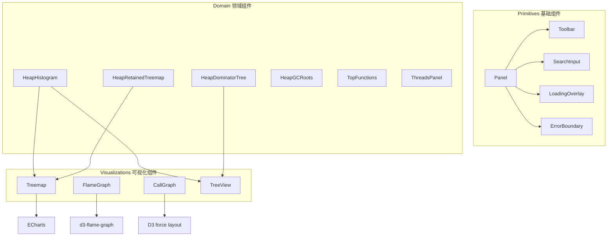
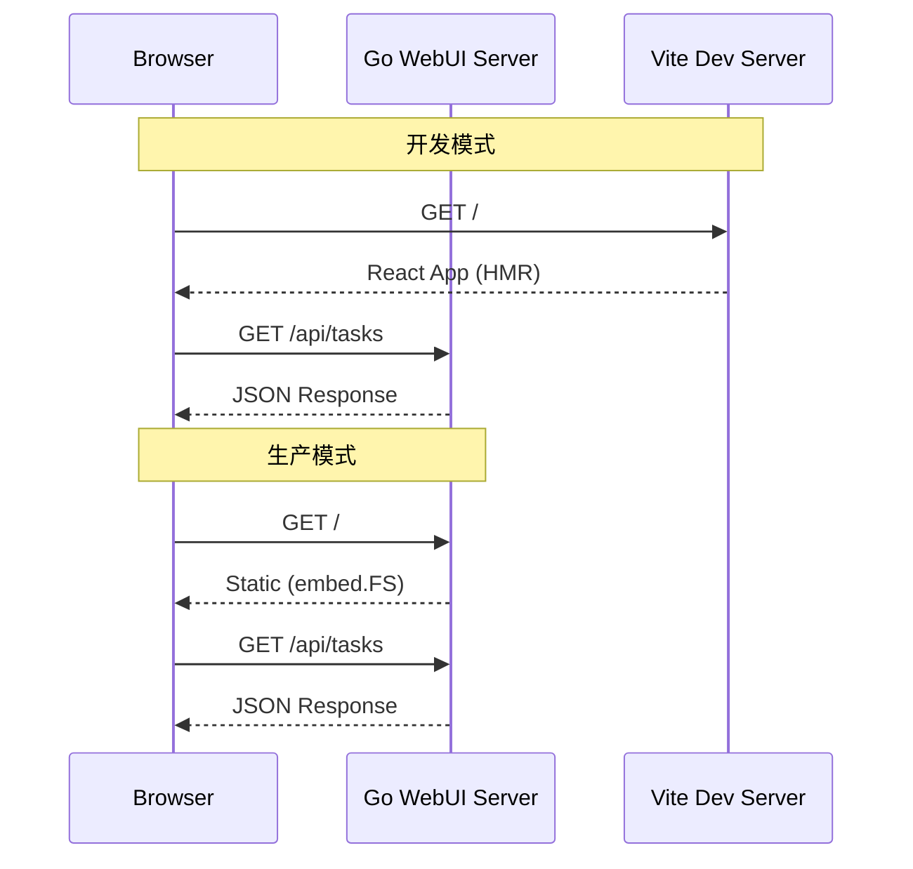
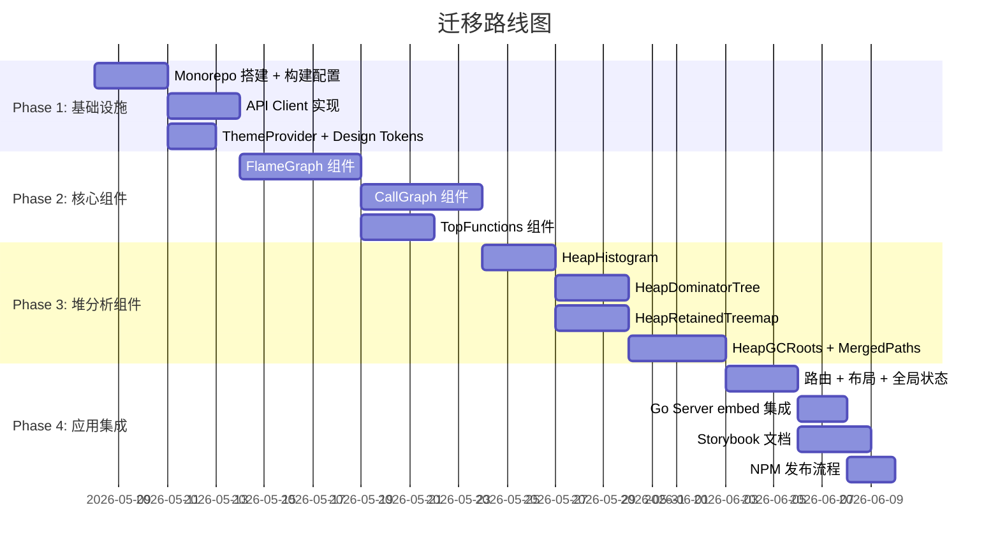

# React 组件库重构方案设计

## 背景

当前 WebUI 前端采用**纯原生 JS + Alpine.js + Tailwind CSS** 实现，存在以下痛点：

| 痛点 | 描述 |
|------|------|
| **不可复用** | IIFE 模块通过 `window.XXX` 全局挂载，无法在其他项目中复用 |
| **不可组合** | 组件间通信靠全局事件 + DOM 直接操作，缺乏声明式组合能力 |
| **不可测试** | 大量 DOM 操作与业务逻辑耦合，无法单元测试 |
| **无类型安全** | 纯 JS 无 TypeScript，重构风险高 |
| **无构建优化** | 350KB+ JS 未压缩，无 Tree-shaking / Code-splitting |
| **主题系统不可移植** | CSS 变量 + `data-theme` 仅在当前 HTML 中有效 |

**目标**：将前端重构为 **React + TypeScript 组件库**，支持 NPM 发布、按需引用、独立部署。

---

## 需求 / 目标

### 核心目标

1. **组件库（npm 包）**：`@perf-analysis/ui` — 可被任何 React 项目 `npm install` 后直接使用
2. **独立应用**：`@perf-analysis/app` — 完整的性能分析 WebUI 应用（组合组件库 + 路由 + 数据层）
3. **保持后端不变**：Go WebUI Server 仅需要改为 serve 前端构建产物，API 接口不变

### 设计原则

- **渐进式迁移**：支持新旧共存，逐步替换，而非一次性重写
- **关注点分离**：数据获取 → 状态管理 → 视图渲染，三层解耦
- **可组合性**：每个可视化组件独立、可嵌入、可定制
- **可测试性**：100% 逻辑可单测，关键组件有 Storybook Stories

---

## 方案设计

### 1. Monorepo 项目结构

采用 **pnpm workspace + Turborepo** 管理 monorepo：

```
web/                                  ← 前端根目录（与 Go 代码平级）
├── package.json                      ← workspace root
├── pnpm-workspace.yaml
├── turbo.json
├── tsconfig.base.json
│
├── packages/
│   ├── ui/                           ← @perf-analysis/ui 组件库
│   │   ├── package.json
│   │   ├── tsconfig.json
│   │   ├── vite.config.ts            ← library mode 构建
│   │   └── src/
│   │       ├── index.ts              ← 统一导出
│   │       ├── components/           ← 可视化组件
│   │       │   ├── FlameGraph/
│   │       │   ├── CallGraph/
│   │       │   ├── ThreadsPanel/
│   │       │   ├── TopFunctions/
│   │       │   ├── HeapHistogram/
│   │       │   ├── HeapGCRoots/
│   │       │   ├── HeapMergedPaths/
│   │       │   ├── HeapBiggestObjects/
│   │       │   ├── HeapDominatorTree/
│   │       │   ├── HeapRetainedTreemap/
│   │       │   └── HeapTreemap/
│   │       ├── hooks/                ← 可复用 Hooks
│   │       │   ├── useApiClient.ts
│   │       │   ├── useFlameGraph.ts
│   │       │   └── useHeapData.ts
│   │       ├── providers/            ← Context Providers
│   │       │   ├── ThemeProvider.tsx
│   │       │   └── ApiProvider.tsx
│   │       ├── types/                ← 公共类型定义
│   │       │   └── index.ts
│   │       └── styles/               ← 样式系统
│   │           ├── tokens.css        ← Design tokens
│   │           └── themes/
│   │
│   └── api-client/                   ← @perf-analysis/api-client
│       ├── package.json
│       ├── src/
│       │   ├── index.ts
│       │   ├── client.ts             ← 基于 fetch 的 API 客户端
│       │   ├── types.ts              ← 请求/响应类型
│       │   └── endpoints/
│       │       ├── tasks.ts
│       │       ├── flamegraph.ts
│       │       ├── callgraph.ts
│       │       ├── heap.ts
│       │       └── refgraph.ts
│       └── tsconfig.json
│
├── apps/
│   └── web/                          ← @perf-analysis/app 完整应用
│       ├── package.json
│       ├── vite.config.ts
│       ├── index.html
│       └── src/
│           ├── main.tsx
│           ├── App.tsx
│           ├── routes/               ← 页面级路由
│           │   ├── Dashboard.tsx
│           │   ├── FlameGraphPage.tsx
│           │   ├── CallGraphPage.tsx
│           │   ├── HeapAnalysisPage.tsx
│           │   └── ThreadsPage.tsx
│           ├── layouts/
│           │   └── MainLayout.tsx
│           └── store/                ← 全局状态（Zustand）
│               ├── taskStore.ts
│               └── settingsStore.ts
│
└── tools/
    └── storybook/                    ← 组件文档 & 预览
        └── .storybook/
```

### 2. 技术选型

| 层次 | 技术 | 理由 |
|------|------|------|
| **框架** | React 18 + TypeScript | 生态最大，组件库复用友好 |
| **构建** | Vite (app) + Vite Library Mode (lib) | 快速 dev、optimized build |
| **样式** | Tailwind CSS 4 + CSS Modules | 原子化 + 组件隔离 |
| **主题** | CSS Custom Properties + ThemeProvider | 运行时切换、可覆盖 |
| **状态管理** | Zustand (app) + React Context (lib) | 轻量无模板代码 |
| **数据获取** | TanStack Query + API Client | 缓存、重试、后台刷新 |
| **可视化** | D3.js + ECharts（保持现有选型） | 已有成熟实现，迁移成本最低 |
| **路由** | React Router v7 | 应用级路由（组件库不含路由） |
| **测试** | Vitest + Testing Library + Storybook | 单测 + 交互测试 + 可视化验证 |
| **文档** | Storybook 8 | 组件 Playground & API 文档 |
| **Monorepo** | pnpm workspace + Turborepo | 构建缓存 + 增量构建 |
| **发布** | Changesets | 语义化版本 + Changelog 自动生成 |

### 3. 组件库设计（`@perf-analysis/ui`）

#### 3.1 组件分层



#### 3.2 组件 API 设计示例

```typescript
// 火焰图组件 — 完全受控
import { FlameGraph } from '@perf-analysis/ui';

<FlameGraph
  data={collapsedData}           // 折叠格式数据
  width="100%"
  height={600}
  colorScheme="hot"              // 'hot' | 'cold' | 'differential'
  searchQuery={searchTerm}       // 高亮搜索
  onFrameClick={(frame) => ...}  // 点击回调
  onFrameHover={(frame) => ...}  // 悬停回调
  tooltip={customTooltip}        // 自定义 Tooltip
  className="my-flamegraph"
/>

// Dominator Tree — 受控 + 懒加载
import { HeapDominatorTree } from '@perf-analysis/ui';

<HeapDominatorTree
  apiClient={client}             // 注入 API Client
  taskId="task-123"
  initialExpanded={['root']}
  sortBy="retained"              // 'retained' | 'shallow'
  onNodeSelect={(node) => ...}
  maxDepth={50}
/>

// 独立使用 Hook（不使用组件）
import { useFlameGraphData } from '@perf-analysis/ui';

function MyCustomView() {
  const { data, loading, error } = useFlameGraphData(taskId);
  // 用自己的方式渲染...
}
```

#### 3.3 API Client 设计

```typescript
// @perf-analysis/api-client
import { createApiClient } from '@perf-analysis/api-client';

const client = createApiClient({
  baseURL: 'http://localhost:8080',  // Go server 地址
  timeout: 30000,
  // 可扩展：认证、重试策略等
});

// 类型安全的 API 调用
const tasks = await client.tasks.list();
const flamegraph = await client.flamegraph.getData(taskId);
const children = await client.refgraph.getDominatorChildren(taskId, objectId);
```

### 4. 构建产物设计

#### 4.1 组件库产物（`@perf-analysis/ui`）

```json
{
  "name": "@perf-analysis/ui",
  "version": "1.0.0",
  "type": "module",
  "main": "./dist/index.cjs",
  "module": "./dist/index.js",
  "types": "./dist/index.d.ts",
  "exports": {
    ".": {
      "import": "./dist/index.js",
      "require": "./dist/index.cjs",
      "types": "./dist/index.d.ts"
    },
    "./styles": "./dist/styles.css",
    "./flamegraph": {
      "import": "./dist/flamegraph.js",
      "types": "./dist/flamegraph.d.ts"
    },
    "./heap": {
      "import": "./dist/heap.js",
      "types": "./dist/heap.d.ts"
    }
  },
  "peerDependencies": {
    "react": ">=18.0.0",
    "react-dom": ">=18.0.0"
  },
  "sideEffects": ["*.css"]
}
```

**支持按需引入**：
```typescript
// 全量引入
import { FlameGraph, HeapDominatorTree, ThemeProvider } from '@perf-analysis/ui';

// 按模块引入（Tree-shakeable）
import { FlameGraph } from '@perf-analysis/ui/flamegraph';
import { HeapDominatorTree } from '@perf-analysis/ui/heap';
```

#### 4.2 应用构建产物（`@perf-analysis/app`）

构建为静态文件，由 Go Server 托管：

```go
// internal/webui/server.go
//go:embed all:dist
var webDist embed.FS

func (s *Server) setupRoutes() {
    // API 路由不变
    mux.HandleFunc("/api/...", ...)
    
    // 前端静态文件
    mux.Handle("/", http.FileServer(http.FS(webDist)))
}
```

### 5. 与 Go Server 集成方案



**开发模式**：Vite Dev Server + Proxy API 到 Go Server
```typescript
// vite.config.ts
export default defineConfig({
  server: {
    proxy: {
      '/api': 'http://localhost:8080',  // 代理到 Go
    },
  },
});
```

**生产模式**：`pnpm build` → 产物嵌入 Go binary via `embed.FS`

### 6. 渐进式迁移策略



#### Phase 1: 基础设施（~1 周）
- Monorepo 搭建（pnpm workspace + Turborepo）
- TypeScript 基础配置、ESLint/Prettier
- `@perf-analysis/api-client` — 从现有 `api.js` 迁移
- `ThemeProvider` — 从现有 `theme.js` + CSS 变量迁移
- 基础 Primitives（Panel、Toolbar、SearchInput）

#### Phase 2: 核心可视化组件（~2 周）
- FlameGraph：封装 d3-flame-graph 为 React 组件
- CallGraph：D3 force layout React 封装
- TopFunctions + ThreadsPanel
- 每个组件配套 Storybook Story + 单测

#### Phase 3: 堆分析组件（~2 周）
- HeapHistogram、HeapTreemap
- HeapDominatorTree（带懒加载 + 虚拟化）
- HeapRetainedTreemap（ECharts React 封装）
- HeapGCRoots + HeapMergedPaths + HeapBiggestObjects

#### Phase 4: 应用集成 & 发布（~1 周）
- 完整 React App 组装（React Router + Zustand）
- Go Server `embed.FS` 集成
- Storybook 部署
- NPM 发布（@perf-analysis/ui + @perf-analysis/api-client）

### 7. 使用方式示例

#### 7.1 安装使用（其他项目）

```bash
npm install @perf-analysis/ui @perf-analysis/api-client
```

```tsx
import { FlameGraph, ThemeProvider } from '@perf-analysis/ui';
import { createApiClient } from '@perf-analysis/api-client';
import '@perf-analysis/ui/styles';

const client = createApiClient({ baseURL: '/api' });

function MyApp() {
  return (
    <ThemeProvider theme="dark">
      <FlameGraph
        apiClient={client}
        taskId="my-task-123"
        height={500}
      />
    </ThemeProvider>
  );
}
```

#### 7.2 按需使用单个组件

```tsx
// 只使用 Dominator Tree，不引入其他组件
import { HeapDominatorTree } from '@perf-analysis/ui/heap';
import '@perf-analysis/ui/styles';

function LeakAnalysisPage({ taskId }) {
  return (
    <HeapDominatorTree
      apiClient={client}
      taskId={taskId}
      sortBy="retained"
      onNodeSelect={(node) => console.log('Selected:', node)}
    />
  );
}
```

#### 7.3 仅使用 Hooks（自定义渲染）

```tsx
import { useHeapDominatorTree } from '@perf-analysis/ui';

function CustomTree({ taskId }) {
  const { roots, expandNode, loading } = useHeapDominatorTree(taskId);
  // 完全自定义渲染逻辑...
}
```

---

## 风险评估

| 风险 | 等级 | 缓解措施 |
|------|------|----------|
| D3/ECharts 与 React DOM 冲突 | 中 | 使用 `useRef` + `useEffect` 隔离命令式操作 |
| 火焰图性能（大数据量） | 高 | Canvas 渲染 + 虚拟化，保留 d3-flame-graph 实现 |
| 迁移期间功能回归 | 中 | 渐进式迁移，新旧可并存（iframe fallback） |
| 包体积过大 | 低 | Vite Library Mode + Tree-shaking + 子路径导出 |
| 组件 API 设计不合理需返工 | 中 | Phase 1 先用 Storybook 验证 API 设计再实现 |

---

## 实施进展

- [ ] Phase 1: Monorepo 基础设施搭建
- [ ] Phase 1: API Client TypeScript 实现
- [ ] Phase 1: ThemeProvider + Design Tokens
- [ ] Phase 2: FlameGraph 组件
- [ ] Phase 2: CallGraph 组件
- [ ] Phase 2: TopFunctions + ThreadsPanel
- [ ] Phase 3: Heap 分析组件族
- [ ] Phase 4: 完整应用集成
- [ ] Phase 4: NPM 发布 + Storybook 部署

---

## 遗留问题

1. **npm scope 命名**：是用 `@perf-analysis/ui` 还是 `@pf-viz/ui` 或其他名称？需确认 npm org
2. **是否需要支持 Vue**：如果有 Vue 使用场景，可以后续通过 Web Components 包装层支持
3. **Go embed 方式 vs 独立部署**：生产模式是嵌入 Go binary 还是独立前端服务（nginx）？
4. **d3-flame-graph vs 自研 Canvas**：当前火焰图依赖 SVG（大数据量可能性能不足），是否在此阶段切换 Canvas 渲染
5. **旧版兼容**：迁移完成后是否保留 Alpine.js 版本作为 fallback
